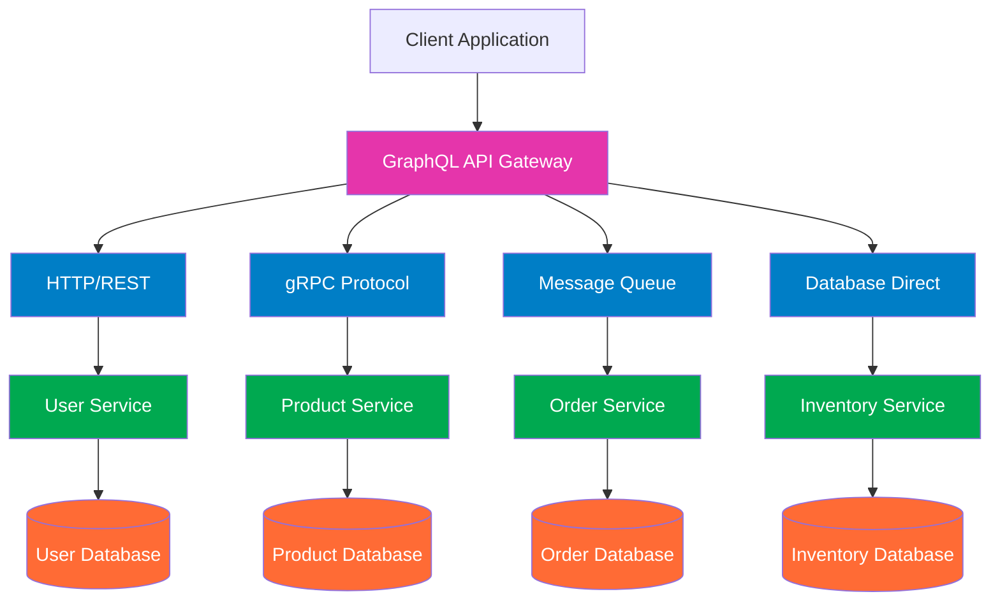

Jelaskan keterkaitan antara GraphQL dengan komunikasi antar proses pada sistem terdistribusi. Buat diagramnya

#  **Keterkaitan GraphQL dengan Komunikasi Antar Proses (IPC) di Sistem Terdistribusi**

GraphQL **bukan** protokol komunikasi antar proses seperti gRPC, Kafka, atau message queue.
**Namun**, GraphQL **sering menjadi *gateway layer*** yang mengkoordinasikan banyak proses/microservices yang saling berkomunikasi di belakang layar.

Dengan kata lain:

> **GraphQL berperan sebagai “orchestrator” yang mengubah permintaan klien menjadi komunikasi antar-proses di dalam sistem terdistribusi.**

##  Cara GraphQL Terkait dengan Komunikasi Antar-Proses

### **1. GraphQL sebagai API Gateway / Aggregation Layer**

Klien mengirim satu query GraphQL → GraphQL server menerjemahkannya menjadi beberapa permintaan ke berbagai microservices.

→ Ini adalah **komunikasi antar proses** (IPC) seperti:

* REST internal
* gRPC
* Message Queue
* Internal event bus

GraphQL hanya menjadi "penerjemah" dan "pengagregasi".

### **2. GraphQL Menyembunyikan Kerumitan Sistem Terdistribusi**

Pengguna hanya melihat **satu endpoint GraphQL**, padahal di belakangnya GraphQL berkomunikasi dengan banyak proses lain.

### **3. GraphQL Mendorong Komposisi Data Secara Terdistribusi**

Resolver GraphQL bekerja seperti:

* proses A memanggil service-user
* proses B memanggil service-product
* proses C memanggil service-order

Lalu GraphQL menggabungkan semua hasil dalam satu response.

### **4. GraphQL Sebagai Koordinator Dependency Antar Service**

Setiap field pada GraphQL dapat memicu pemanggilan internal ke service lain.
Ini otomatis menjadi *dependency graph* komunikasi antar proses.

---

#  **Diagram Hubungan GraphQL dan Komunikasi Antar Proses**

# **Kesimpulan **

* GraphQL **bukan protokol IPC**, tetapi **memanfaatkan IPC** (REST/gRPC/MQ) untuk mengambil data.
* GraphQL bertindak sebagai **layer penghubung** antara klien dan berbagai proses/microservice.
* Setiap field dalam GraphQL dapat memicu **komunikasi antar proses** di sistem terdistribusi.
* GraphQL menyederhanakan interaksi multi-service menjadi **satu query dari klien**.

---

